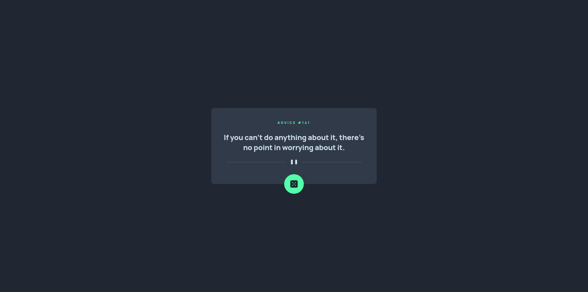

# Frontend Mentor - Advice generator app solution

This is a solution to the [Advice generator app challenge on Frontend Mentor](https://www.frontendmentor.io/challenges/advice-generator-app-QdUG-13db). Frontend Mentor challenges help you improve your coding skills by building realistic projects.

## Table of contents

- [Overview](#overview)
  - [The challenge](#the-challenge)
  - [Screenshot](#screenshot)
  - [Links](#links)
- [My process](#my-process)
  - [Built with](#built-with)
  - [What I learned](#what-i-learned)
  - [Useful resources](#useful-resources)
- [Author](#author)

## Overview

### The challenge

Users should be able to:

- View the optimal layout for the app depending on their device's screen size
- See hover states for all interactive elements on the page
- Generate a new piece of advice by clicking the dice icon

### Screenshot

### Links

- [Solution URL](https://github.com/iankakaruzia/advice-generator-app)
- [Live Site URL](https://advice-generator-app-wine-kappa.vercel.app/)

## My process

### Built with

- TailwindCSS
- Flexbox
- Mobile-first workflow
- [Remix](https://remix.run/) - Framework

### What I learned

This was my first time working with Remix, and I thoroughly enjoyed. I was able to use the knowledge that I have from React/Next.JS in it.

### Useful resources

I used these two repositories to guide me on the Remix path.
- [NBA Remix](https://github.com/willianjusten/nba-remix) from Willian Justen
- [Indie Stack](https://github.com/remix-run/indie-stack) from Remix
## Author

- Frontend Mentor - [@iankakaruzia](https://www.frontendmentor.io/profile/iankakaruzia)
